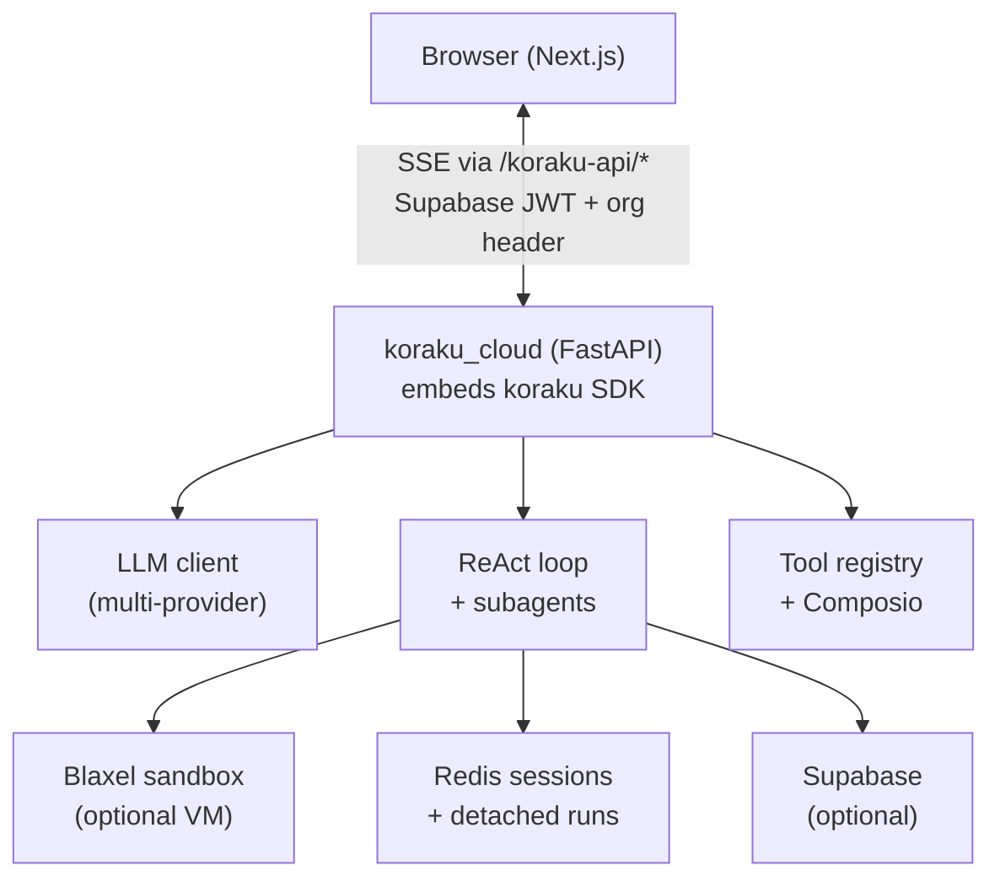

# Building Koraku — an AI agent that actually does things

Most of my projects before this were tutorials, homework, or half-finished experiments. Koraku was different. I set out to build something I would actually use: a personal AI assistant that could search the web, read and write files, run code, connect to my email and calendar, remember who I am, and work from my phone over iMessage — not just chat in a browser tab.

That project became **Koraku** (from Japanese *koraku*, meaning enjoyment or pleasure). It started as a Python agent SDK and grew into a full product: a self-hostable AI platform with a web app, multi-tenant auth, automations, and an embeddable SDK other developers can use.

This post is the story of what it is, how it works, and what I learned building it.

## What Koraku Is

At its core, Koraku is a **ReAct agent** — a loop where a large language model reasons, calls tools, reads the results, and repeats until the task is done or it has a final answer. Think of it less like ChatGPT in a box and more like a coworker with access to your computer, the internet, and your connected apps.

Koraku ships in two layers:

| Layer | What it is | Who it's for |
| :--- | :--- | :--- |
| **koraku SDK** | Embeddable Python agent library | Developers building bots, CLIs, or custom backends |
| **Koraku Cloud** | Full product: web UI, auth, automations, iMessage | End users (and me) who want a ready-to-run assistant |

The SDK is open source on [GitHub](https://github.com/meet447/Koraku). The Cloud monorepo ([koraku-cloud](https://github.com/meet447/koraku-cloud)) vendors the same SDK sources and adds the product layer on top.

## What It Can Do

### 1. Streaming chat with real tools

Every conversation runs through a tool-augmented agent loop. The model can:

- **WebSearch / WebFetch** — research live information via Exa and Firecrawl
- **Read / Write / Edit / Grep / Glob** — work with files in a workspace
- **Bash** — run shell commands, scripts, git, pip installs
- **TodoWrite** — track multi-step work internally

Tools run either on the host machine (local/self-hosted mode) or inside an isolated Blaxel sandbox VM (cloud execution mode) — one VM per user, with a dedicated folder per chat session.

### 2. Connected apps (Composio)

Through Composio, Koraku connects to Gmail, Google Calendar, Slack, and dozens of other services. OAuth is handled by Composio; Koraku loads dynamic tool definitions at runtime based on what the user has connected.

For complex integration tasks, Koraku can delegate to a **Composio subagent** — a nested agent run scoped to specific toolkits so the main conversation stays clean.

### 3. Document and artifact generation

Koraku can produce real deliverables, not just markdown in chat:

- Word documents (`.docx`) via `DocumentRun`
- Presentations (`.pptx`) via `PresentationRun`
- Spreadsheets (`.xlsx`) via `SpreadsheetRun`
- PDF merge/split via `PdfRun`

These run as specialized subagents with artifact-building tools inside the sandbox.

### 4. Memory and personalization

Koraku has a second brain layer:

- **Memory.md** — durable facts the agent should remember about you
- **Soul.md** — persona, tone, and behavioral preferences
- **Supabase-backed personalization** — per-user, per-organization profiles in Cloud mode
- **Supermemory integration** — optional learned memory prefetch for long-term recall

Before making claims about your history or preferences, the agent is instructed to search memory first.

### 5. Automations

Scheduled and event-driven jobs:

- **Cron-style automations** — "every Monday at 9am, summarize my inbox"
- **Composio event triggers** — react to external events
- Run history stored in Supabase, scoped by organization

### 6. iMessage (SendBlue)

Optional but important to me: Koraku works over iMessage via SendBlue. Inbound messages hit a webhook, run through the same agent loop, and replies go back as texts. Personalization and sandbox paths are injected the same way as web chat — your AI buddy in your pocket.

### 7. Multi-channel, multi-tenant Cloud

The web app supports:

- Supabase Auth (email, OAuth)
- Organization switching (B2B-style workspaces)
- Chat threads with persistent history
- Workspace file browser
- Connected apps UI
- Automation management

## Architecture

### Tech stack

**Backend**

- Python 3.11+, FastAPI, Pydantic v2
- Anthropic / OpenAI-compatible LLM clients (Fireworks, etc.)
- Redis for session store and detached run buffering
- APScheduler + croniter for automations
- Docker Compose for self-hosting

**Frontend**

- Next.js 15, React 19, Tailwind CSS
- `@koraku/client` — TypeScript SSE client package
- Supabase SSR for auth
- BFF proxy pattern: browser never talks to Python directly; Next.js adds auth headers

**Infrastructure**

- VPS deployment via rsync + Docker (`scripts/deploy-vps.sh`)
- Blaxel for isolated code execution sandboxes
- Composio for OAuth integrations
- SendBlue for iMessage

## How the Agent Loop Works

Each user message triggers a turn:

1. **Context assembly** — system prompt (persona, workspace, memory, connected apps), conversation history, tool schemas
2. **LLM stream** — model returns text and/or tool calls
3. **Tool execution** — tools run in parallel where safe; results feed back as `tool_result` messages
4. **Repeat** — until the model produces a final text response or hits step/wall-clock budget
5. **SSE events** — every step streams to the client: tool calls, partial text, usage estimates, completion

Important design choices I made along the way:

- **Task-class budgeting** — quick questions get fewer steps; research and artifact tasks get more
- **Subagent delegation** — Composio and artifact runs are nested agents with their own context windows
- **Context compaction** — long conversations summarize old turns and drop completed tool pairs to stay within token limits (with careful handling so tool call chains never break)
- **Execution targets** — same agent code runs locally or in Blaxel; tools dispatch based on `execution_target`

## Hard Problems I Actually Solved

This is where "serious project" shows up. Koraku isn't a demo — I deployed it, used it daily, and fixed real bugs.

**Performance under load.** Sync Redis and disk I/O were blocking the async event loop. I offloaded session reads/writes and file tools to thread pools, cached Composio tool builds with TTL, and optimized detached-run Redis writes.

**Sandbox Python hell.** The Blaxel VM uses Alpine with an externally-managed Python. Agents kept failing on `pip install matplotlib`. I added auto `.koraku-venv` bootstrap on every Bash call and documented sandbox patterns in the system prompt.

**Context window crashes.** After 20+ tool calls, history trimming could orphan `tool_result` messages from their matching `tool_use` calls — causing LLM API 400 errors. I fixed sliding-window and summary cut points to preserve tool pairs.

**Write truncation.** Large file writes failed when streamed tool JSON arrived incomplete. I added `Write` with `mode=append` for chunked writes and clearer error hints pointing to Bash heredoc.

**iMessage parity.** The iMessage runner wasn't fetching personalization profiles — replies felt generic compared to web chat. Fixed by mirroring the same `fetch_account_personalization` path.

**328 tests.** The test suite covers agent budgeting, SSE events, context compaction, Blaxel path mapping, auth, automations, and more. CI runs on every push.

## The Product Layer (koraku_cloud)

The SDK alone isn't a product. `koraku_cloud/` adds:

- **Supabase integration** — chat history, personalization, automations, org scoping
- **Product hooks** — pluggable auth, health checks, billing hooks
- **Workspace routes** — file browser API backed by session roots
- **SendBlue webhook** — iMessage ingress/egress
- **Bootstrap** — `bootstrap_cloud()` registers all product behavior at startup

The web app proxies everything through `/koraku-api/*` so Supabase cookies become Bearer tokens server-side — service keys never reach the browser.

## What I Learned

**Start with the agent loop, not the UI.** The SDK came first. Once streaming, tools, and sessions worked in a Python script, the web app was "just" a client.

**Sandboxes are non-negotiable for agent file access.** Letting an LLM run Bash on your laptop is fine for dev. For a product, isolated VMs per user with scoped session folders is the right model.

**Memory is a product feature, not a prompt trick.** Users expect the assistant to remember their name, preferences, and past context. File-based memory + Supabase profiles + optional Supermemory is a layered approach that actually works.

**Tool-heavy runs need infrastructure thinking.** Context management, concurrency limits, heartbeats during long tool phases, detached runs for reconnect — these aren't glamorous but they're what separates a toy from something you trust daily.

**Monorepo with a clean SDK boundary.** `koraku/` syncs to the OSS repo; `koraku_cloud/` stays product-specific. Embedders get `pip install koraku` without Supabase baggage.

## Where It Stands Today

- **Version:** 0.2.0 (beta)
- **License:** MIT
- **Deployed:** Self-hosted on a VPS with Docker (API + Redis)
- **Tests:** 328 passing
- **Channels:** Web chat, iMessage (SendBlue), embeddable SDK

Recent work focused on making the agent reliable for creative and technical tasks — charts, scripts, research reports — without dying mid-run on environment or context issues.

## Links

- **Live demo:** [koraku.chipling.xyz](https://koraku.chipling.xyz)
- **Cloud repo:** [github.com/meet447/koraku-cloud](https://github.com/meet447/koraku-cloud)
- **SDK repo:** [github.com/meet447/Koraku](https://github.com/meet447/Koraku)
- **Self-host guide:** Docker Compose → `http://localhost:3000`

Koraku is the project where I stopped building demos and started building systems — async agents, sandbox isolation, multi-tenant auth, streaming protocols, and the unglamorous work of making an LLM actually finish the job. It's my first serious project, and I'm still shipping.
