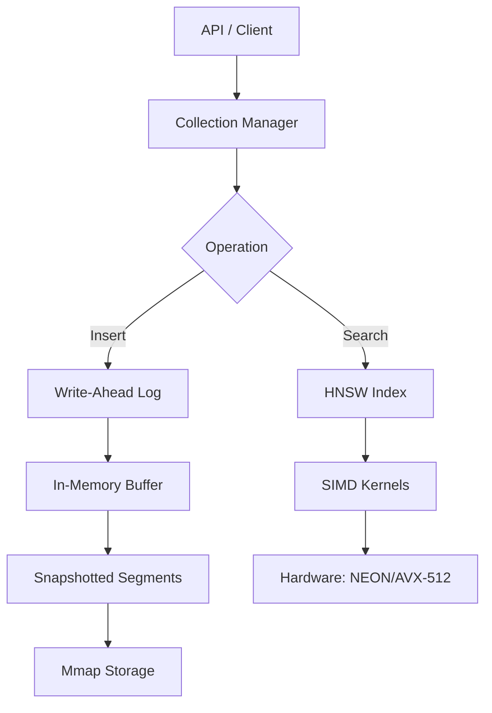

# Introduction

Most vector databases today are designed for massive cloud clusters. While production-grade systems like Qdrant or Milvus are incredible, they often require significant resources just to idle—sometimes upwards of 500MB+ of RAM.

I wanted something different. I wanted a vector database that could run on the edge, in a browser via WASM, or on a tiny Raspberry Pi, without sacrificing performance. That’s why I built **SurgeDB**.

SurgeDB is an ultra-lightweight, SIMD-powered vector database written entirely in Rust. It’s designed for efficiency, portability, and raw speed.

# Why SurgeDB?

The core philosophy behind SurgeDB is **efficiency at the edge**. Here’s what sets it apart:

1.  **Ultra-Low Footprint**: While others idle at hundreds of megabytes, SurgeDB can index 100k vectors using only ~39MB of RAM (when using SQ8 quantization).
2.  **Edge-First Performance**: I hand-tuned the kernels specifically for Apple Silicon (NEON) and modern x86_64 (AVX-512). This isn't just generic optimization; it's hardware-aware compute.
3.  **Zero Dependencies**: Written in pure Rust. No Python runtime required, no Docker containers necessary. It’s a single binary or a library you can embed anywhere.

# Key Features

- **Adaptive HNSW Indexing**: High-speed approximate nearest neighbor search that scales gracefully.
- **SIMD Optimized**: Manual SIMD implementations for distance metrics (Cosine, Euclidean, Dot Product) ensure we squeeze every bit of performance out of the CPU.
- **Plug-and-Play Quantization**:
    - **SQ8**: 4x compression with <1% accuracy loss.
    - **Binary**: 32x compression for truly massive datasets where memory is the ultimate constraint.
- **ACID-Compliant Persistence**: Includes a Write-Ahead Log (WAL) and snapshotting system to ensure your data is safe even if the process crashes.
- **WASM Support**: Runs entirely in the browser, enabling local AI applications without any backend infrastructure.

# Performance Snapshot

To validate SurgeDB, I benchmarked it against Qdrant on an M2 Mac using a heavy workload (768-dimensional SigLIP vectors) with extensive metadata filtering.

| Operation | Qdrant (Local) | SurgeDB (Local) | Comparison |
| :--- | :--- | :--- | :--- |
| Create Collection | 64.58 ms | 2.08 ms | **SurgeDB ~31x faster** |
| Search Avg | 3.52 ms | 0.64 ms | **SurgeDB ~5.5x faster** |
| Retrieve by ID | 7.03 ms | 0.68 ms | **SurgeDB ~10x faster** |
| Bulk Upsert (5k) | 2,384 ms | 5,257 ms | Qdrant ~2.2x faster |

While Qdrant wins on bulk ingestion (thanks to its mature multi-threading), SurgeDB's search and management overhead is significantly lower, making it ideal for real-time edge applications.

# Architecture

SurgeDB uses a hybrid storage engine to balance speed and durability. Here is a high-level overview of how data flows through the system:



# How to use it?

### Rust
Integrating SurgeDB into a Rust project is straightforward:

```rust
use surgedb_core::{PersistentVectorDb, PersistentConfig, DistanceMetric};

fn main() {
    let config = PersistentConfig {
        dimensions: 384,
        distance_metric: DistanceMetric::Cosine,
        ..Default::default()
    };
    let mut db = PersistentVectorDb::open("./surgedb_data", config).unwrap();

    let vec = vec![0.1; 384];
    let meta = serde_json::json!({"title": "SurgeDB Guide"});
    db.insert("doc_1", &vec, Some(meta)).unwrap();

    let results = db.search(&vec, 5).unwrap();
    println!("Found match: {} (meta: {:?})", results[0].0, results[0].2);
}
```

### WebAssembly (WASM)
Because SurgeDB is written in Rust, it compiles beautifully to WASM, allowing for high-performance vector search directly in the browser:

```javascript
import init, { SurgeDB } from './pkg/surgedb_wasm.js';

async function run() {
    await init();
    const db = new SurgeDB(384);
    db.insert("doc_1", new Float32Array([0.1, ...]), { title: "Hello" });
    const results = db.search(new Float32Array([0.1, ...]), 5);
}
```

# What's Next?

SurgeDB is still evolving. My current roadmap includes:
- **UniFFI Bindings**: Bringing SurgeDB to Python, Swift, and Kotlin.
- **Zero-Config RAG Pipeline**: Deep integration with [Candle](https://github.com/huggingface/candle) for a complete on-device RAG experience.

Building SurgeDB has been a deep dive into low-level systems programming, SIMD intrinsics, and the nuances of vector indexing. It’s proof that you don’t always need a massive cluster to do high-performance AI work.

Check out the project on GitHub: [meet447/surgedb](https://github.com/meet447/surgedb)
