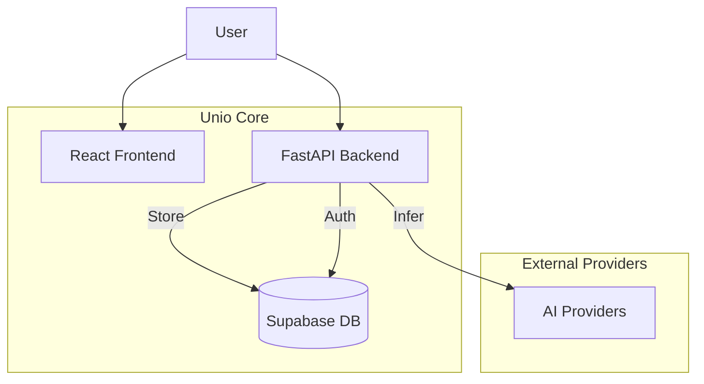

# The Problem: API Fragmentation

As an AI developer, I found myself constantly fighting with multiple SDKs. OpenAI has one library, Anthropic another, Google a third. Every time I wanted to switch models or add a fallback, I had to rewrite my integration code.

Plus, managing API keys across different environments and worrying about rate limits or downtimes became a headache. I needed a layer that abstracted this complexity away.

# Introducing Unio

**Unio** is a unified AI gateway that simplifies working with multiple LLM providers through a single, OpenAI-compatible API. Instead of managing separate integrations, you get one interface with intelligent features built-in.

> **One API for ALL LLMs.**  
> Unify your AI providers with intelligent key management, automatic failover, and comprehensive analytics.

## Key Benefits

### Bring Your Own Keys

Use your existing API keys across all providers. Unio doesn't resell compute; it manages your access.

### Automatic Key Rotation & Failover

Unio acts as a smart load balancer. If one key hits a rate limit or a provider goes down, Unio automatically seamlessly switches to the next available key or a fallback model.

### Advanced Analytics

Track usage, costs, and performance across all your providers in one dashboard. No more logging into five different consoles to see where your money is going.

### OpenAI SDK Compatible

Unio is designed to be a drop-in replacement. You can use the standard OpenAI Python or Node.js SDKs—just change the `base_url` and `api_key`.

```python
from openai import OpenAI

# Use Unio as a drop-in replacement
client = OpenAI(
    api_key="your-unio-token",
    base_url="https://api.unio.dev/v1"
)

response = client.chat.completions.create(
    model="anthropic:claude-3-5-sonnet-20241022",
    messages=[
        {"role": "user", "content": "Hello from Unio!"}
    ]
)
```

## Architecture

Unio follows a modern microservices architecture designed for scale:



- **FastAPI Backend**: Handles high-concurrency request routing and streaming.
- **React Frontend**: A clean dashboard for managing keys and viewing analytics.
- **Supabase**: For secure database and authentication.
- **Redis (Planned)**: For intelligent semantic caching to reduce costs.

## Open Source

Unio is fully open source (MIT License). I built it because I needed it for my own projects like **Axiom** (AI search engine) and **Chipling** (research tool), and I believe it can help other developers too.

Check out the code on [GitHub](https://github.com/maoucodes/Unio) or try the hosted version at [unio.chipling.xyz](https://unio.chipling.xyz).
