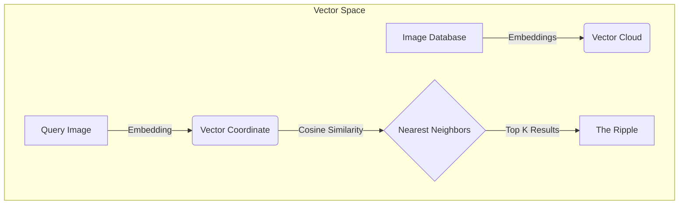
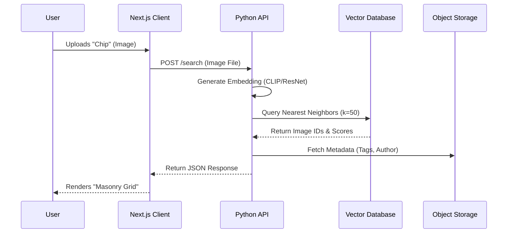

# Introduction

For decades, the web has been indexed by **keywords**. If you wanted to find a "moody, brutalist concrete structure," you had to type exactly that. But language is a lossy compression algorithm for visual thoughts. The specific texture of concrete, the way light hits a corner, the *feeling* of a space—these things defy simple tags.

**Chipling** is our answer to this limitation. It is not a keyword search engine; it is a **Visual Discovery Engine** powered by **Vector Embeddings**.

## The Problem: The Keyword Prism

Traditional search engines view the world through a rigid prism of text.

If the metadata doesn't match your query, the image doesn't exist. This creates a "discovery gap" where valuable inspiration is lost simply because it wasn't tagged correctly.

## The Solution: High-Dimensional Vector Space

Chipling typically uses models like **CLIP (Contrastive Language-Image Pre-Training)** to convert images into **Vectors**—long lists of numbers (e.g., 512 or 1024 dimensions) that represent the *semantic meaning* of an image.

In this high-dimensional space, concepts that are visually or semantically similar naturally cluster together.

### Visualizing the "Digital Ocean"

Imagine a 3D space where every point is an image.

- **Cluster A**: "Minimalist Furniture"
- **Cluster B**: "Cyberpunk Cityscapes"
- **Cluster C**: "Organic Textures"

When you search, you aren't looking for a word; you are determining a **coordinate** in this space and asking, "What else is near here?"

## The "Ripple" Mechanic

We call our search results a **"Ripple"** because of how the discovery process works. You drop a single "Chip" (a seed image) into the ocean, and the results radiate outward based on semantic proximity.

1. **The Drop**: You upload or select an image.
2. **The Splash**: The system calculates the vector embedding of that image on the fly.
3. **The Ripple**: We perform an Approximate Nearest Neighbor (ANN) search to find images with the highest **Cosine Similarity**.

### Architecture Overview

Chipling's architecture is designed for speed and scale.

## Why This Matters

This shift from **Symbolic AI** (rules/keywords) to **Connectionist AI** (vectors/neural networks) changes how we interact with information.

- **Serendipity**: You find things you didn't know you were looking for.
- **Aesthetic Continuity**: You can maintain a specific "vibe" across a search session without guessing synonyms.
- **Language Agnostic**: A "sunset" looks the same in English, Japanese, or code.

## The Future: A Digital Shared Brain

We see Chipling not just as a tool, but as a **collective memory**. As users curate and connect Chips, they are effectively fine-tuning the latent space of the community. In the future, we aim to allow users to train their own "personalized subspaces"—effectively giving everyone their own lens through which to view the digital world.
